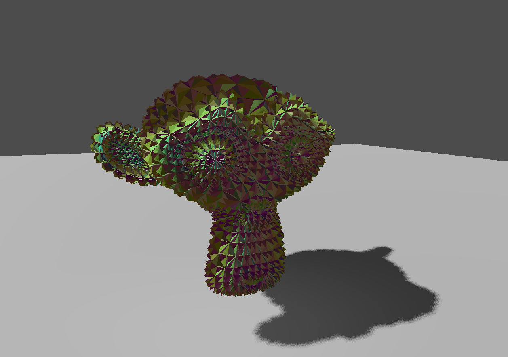

# Hello, Compute Geometry!

This is a tech demo for mocking geometry shaders in Godot using compute shaders.
Take input data, and produce a varying number of triangles from it.

This particular demo takes each triangle, splits it into three,
and has the center vertex move in and out.
If you run the demo, you can use WASDQE to move, and hold right-click to pan (like in the editor).

## How does it work?

With raw access to a graphics library, you can send a buffer of vertices (or whatever) to the GPU,
have a compute shader write your vertices to another buffer, and then render that directly.

However, [Godot doesn't currently support rendering directly from a buffer of meshes](https://github.com/godotengine/godot-proposals/issues/5995#issuecomment-1741841412).
So, this is my hackneyed solution:

- Send a buffer of data to a compute shader.
- In the compute shader, write the output data to a *texture*, which Godot does support sharing between shaders.
  In this demo I'm using an RGBA texture, so each pixel is a vec4;
  this means I can put a vertex's position, normal, UV, and 2 floats of scratch in 3 pixels per vertex.
- Generate a dummy mesh with some giant number of arbitrary triangles.
- Render the dummy mesh with a vertex shader that just ignores the input vertex and reads the vertex data out
  of the texture the compute shader wrote to.
  (Note the number of input vertices in the dummy mesh must be enough to cover all the vertices the compute shader
  writes!
  Additional unused vertices have all their values set to 0, so they don't render.)

I've left comments throughout, which hopefully are helpful.
I've also tried to make it clear what is necessary for this to work at all,
and what is just for this particular shader.

## Structure

The Godot script that orchestrates all this is `./ComputeGeometryOrchestrator.gd`.
This is probably the best-commented thing in the project.

The compute shader is `shaders/write_triangles.glsl`.

The Godot shader that unpacks the vertices from the texture is `shaders/unpack_verts_from_compute.gdshader`.

## Citations

The source code has a lot of links to stuff I found was helpful at the moment, but not all of it is the best.
Here's my curated list of citations:

- [`https://github.com/erickweil/GodotTests/tree/main/ProceduralGeometry`].
  This was my main source; thanks Erick!
- [`https://learnopengl.com/Guest-Articles/2022/Compute-Shaders/Introduction`].
  Easy-to-digest rudiments of compute shaders.
- [`https://ktstephano.github.io/rendering/opengl/prog_vtx_pulling`].
- [`https://stackoverflow.com/q/38172696`].
  OpenGL expects the data being sent to anything on the GPU to be packed in a certain way, and it's a giant footgun.
  This is why there is a `_scratch` variable in the `Vertex` struct, and why I'm using `vec4`s instead of `vec3`s.
- [`https://www.khronos.org/opengl/wiki/Compute_Shader`]. The wiki is kind of spotty, but sometimes helpful.

If you don't understand how something works, open an issue please!
I was tearing my hair out trying to figure out how to do this, and I'd love if this repo was a helpful source if you want to do the same.

